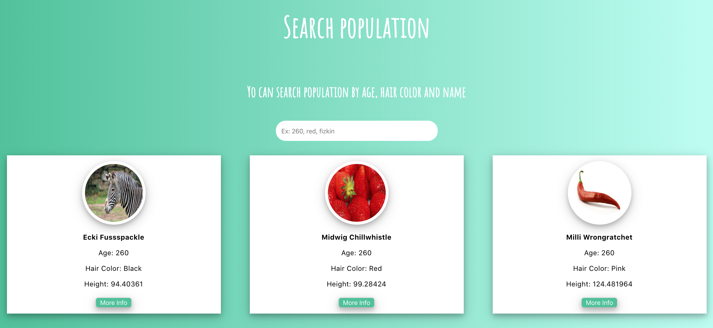

# Brastewark app

## Introduction

Easily search the gnome popultaion, and check details.

## Functional description

Users can:

- Search population by name, age and hair color.
- View information of all population

## Available Scripts

In the project directory, you can run:

#### `yarn install`

Install dependecies. 

#### `yarn start`

Runs the app in the development mode. 
Open [http://localhost:3000](http://localhost:3000) to view it in the browser.

#### `yarn test`

Launches the test runner in the interactive watch mode. 

### Technologies

Javascript, ReactJS(Hooks), SASS.

### Libs Used

Enzyme, Jest
